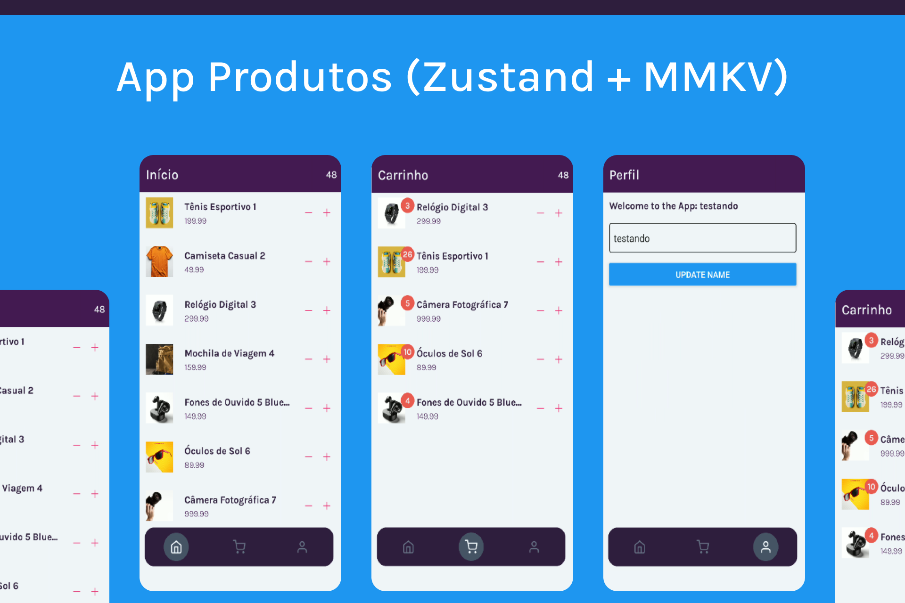
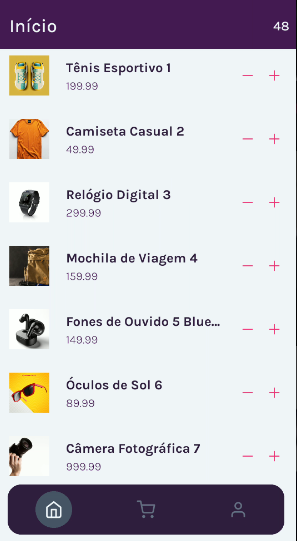
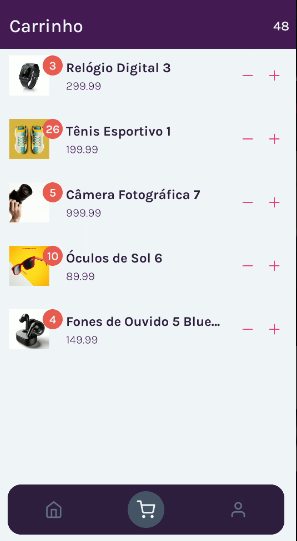
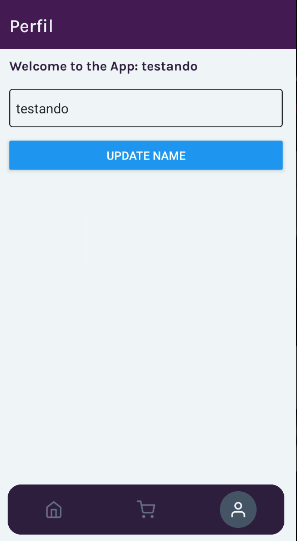

<h1 align="center">React Native State Control (Zustand + MMKV)</h1>

<p align="center">
  

  

  
  
  <a href="https://github.com/williamjayjay/Github-Blog/commits/master">
    
  </a>
    
   <a href="https://github.com/williamjayjay/rn-state-zustand-mmkv/stargazers">
    
  </a>
</p>

<p align="center"><p align="center">
Este aplicativo tem como a principal funcionalidades o gerenciamento de estado utilizando a biblioteca Zustand e a persistência dos dados no storage do dispositivo de maneira mais leve e rápida com a biblioteca MMKV que é cerca de 10x mais rápida que o async storage por exemplo.</p>

<p align="center">

</p>

## VideoCase
https://github.com/user-attachments/assets/00c048c4-eedf-49bc-bf61-3dcf7c2ab446


## 🥶 Sobre o projeto

Desenvolvi esse projeto para reforçar meu conhecimento com o gerenciamento de estados da lib zustand juntamente com o armazenamento local com a lib mmkv.

## Mobile React Native:

**Aplicativo:** O app deverá adicionar e remover do carrinho os itens listados e também ser possível alterar o nome do usuário.

## 🚀 Tecnologias

Principais tecnologias que utilizei para desenvolver esta aplicação

- [Typescript](https://www.typescriptlang.org/)
- [React-Navigation](https://reactnavigation.org/)
- [RN Screens](https://github.com/software-mansion/react-native-screens)
- [Expo-Font](https://docs.expo.dev/versions/latest/sdk/font/)
- [NativeWind](https://www.nativewind.dev/quick-starts/expo)
- [TailwindCSS](https://www.nativewind.dev/)
- [Classnames](https://www.npmjs.com/package/classnames)
- [RN-MMKV](https://github.com/mrousavy/react-native-mmkv)
- [Zustand](https://zustand-demo.pmnd.rs/)
- [RN Safe Area Context](https://docs.expo.dev/versions/latest/sdk/safe-area-context/)

## Guia de inicialização

Para instalar e configurar uma cópia local, siga estas etapas simples:

### Prerequisitos

Para garantir o funcionamento adequado da nossa aplicação, verifique abaixo:

1. **Clone o repositório**:
  ```sh
  git clone https://github.com/williamjayjay/rn-state-zustand-mmkv
  ```

2. **Navegue na raiz do projeto rn-state-zustand-mmkv:**

3. **Instale os módulos:**
  ```sh
  bun i
  ```

4. **Rode o prebuild requerido pela biblioteca mmkv:**
  ```sh
  npx expo prebuild
  ```

5. **Rode o aplicativo:**
  ```sh
  bun android
  ```

## Roadmap

- [x] Iniciar o aplicativo, entrar na tela home com a lista de produtos.

- [x] Conseguir adicionar e remover itens ao carrinho.

- [x] Conseguir visualizar a contagem dos items no header.

- [x] Conseguir navegar via tabBar para a tela do carrinho e também tela de perfil.

- [x] Na tela do carrinho ser possível visualizar a quantidade de cada item específico no carrinho.

- [x] Na tela de perfil ser possível alterar o nome do usuário.

- [x] Ao reiniciar a aplicação deve ser persistido os dados.

<!-- --------------------- -->

| Tela Home | Tela Carrinho |
|:-------------------------:|:-------------------------:|
|  |  |

| Tela Perfil |
|:-------------------------:|
|  |


